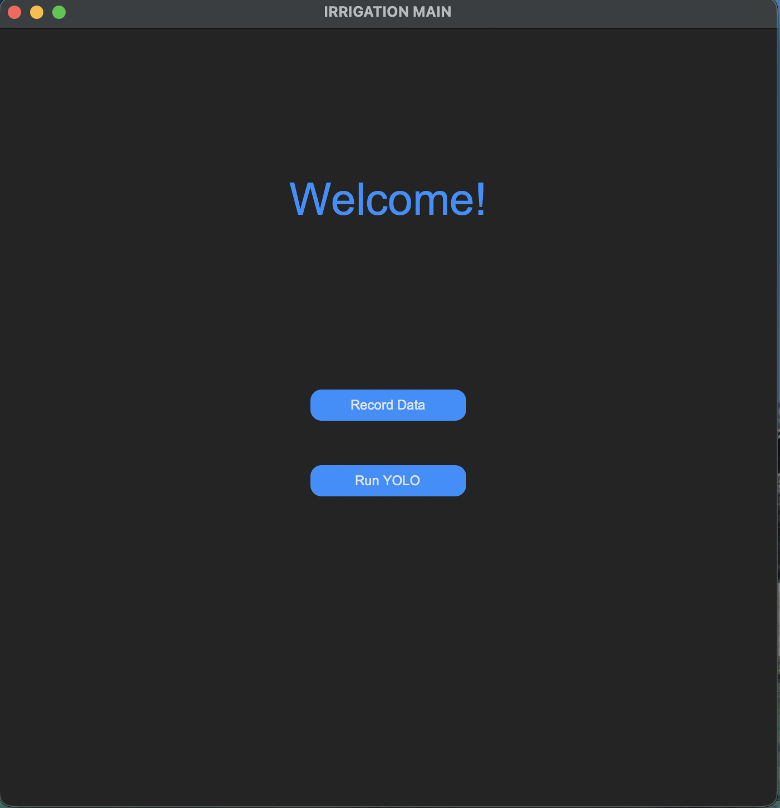
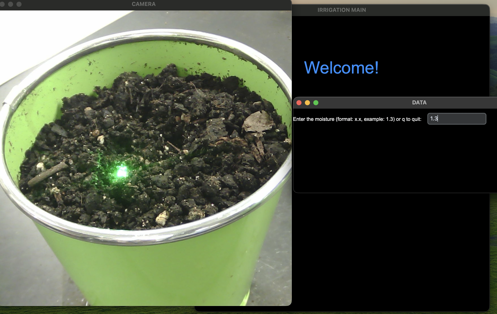
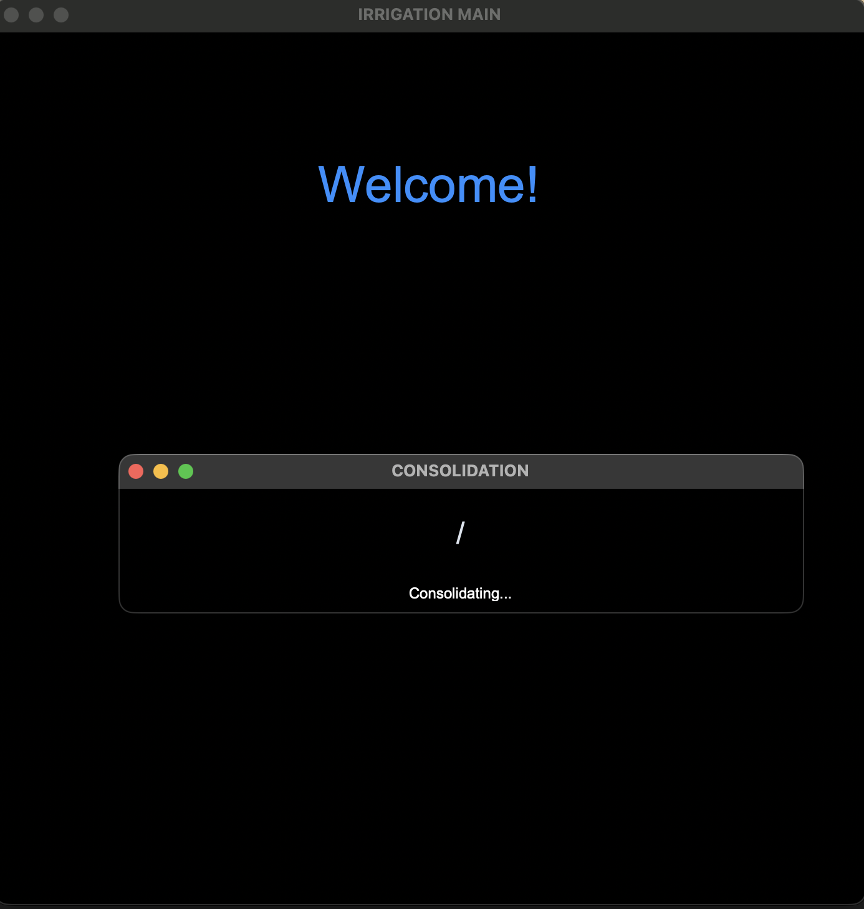
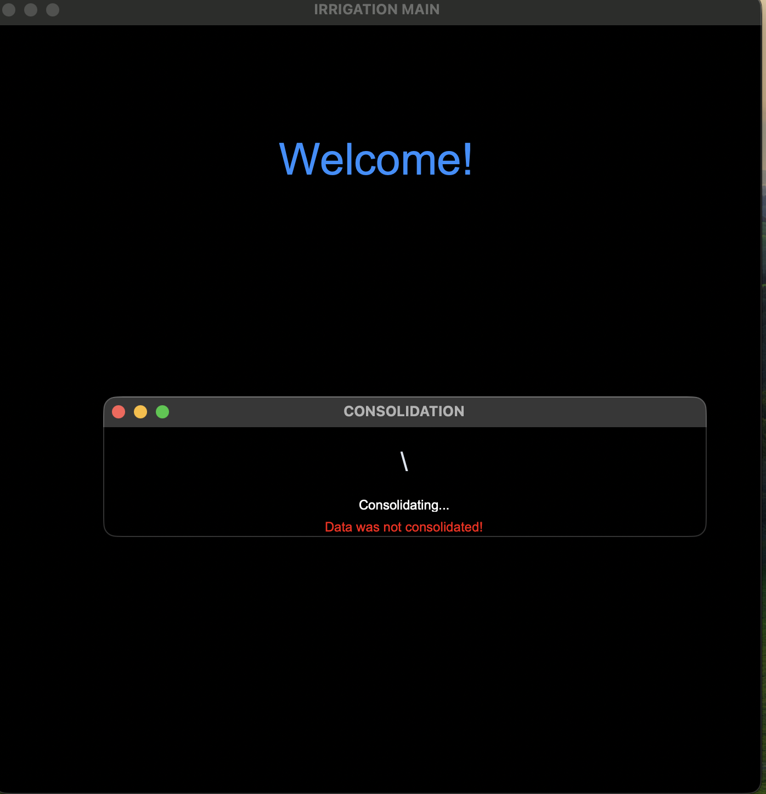

# Irrigation Main App - Ubuntu Setup 

## Overview
The **Irrigation Main App** is a graphical user interface (GUI) built with **Python** and **CustomTkinter** to assist with soil moisture data collection, image post-processing, and automated AI training.

It provides an end-to-end workflow for recording images using a camera module, consolidating those images with corresponding soil moisture readings, and automatically triggering `YOLO training` using Roboflow-managed datasets.

---
## Features 

## User-Friendly GUI 
- Built using CustomTkinter for a modern interface
- Provides intuitive dialogs and visual feedback
- Modular layout allows easy extension for new tools (Roboflow, training, visualization)



## Camera Recording
- Captures and stores images directly from the connected camera
- Automatically saves each captured image in the data collection directory 




##  Data Consolidation
- Combines recorded images with corresponding moisture readings stored in `moistures.csv`
- Draws the moisture value directly onto each image
- Saves consolidated images into the `Post-Processing` directory
- Prevents continuation if `moistures.csv` is missing or empty 

 


## Automated YOLO Training
- Fully automated YOLO training pipeline integrated into the application
- Consolidated images are prepared and validated automatically
- Datasets are synced using Roboflow
- YOLO training is triggered programmatically (no manual CLI commands)
- Training runs and outputs are stored in `GUI/Collections/Training/Sessions`

This enables a complete `data collection` → `Roboflow upload `→ `processing` → `training workflow` from a single GUI.
##  Project Structure
```
Irrigation-Main-App/
│
├── application.py
├── GUI/
|      ├── Collections/
│      |              ├── Core/
|      |              |       ├── path_manager.py
|      |              |       ├── recorder.py
|      |              |       ├── system_manager.py
|      |              |       ├── trainer.py
|      |              |
|      |              ├── DataCollection/
|      |              |                 ├── Data/
|      |              |                 ├── Post-Processing/
|      |              |                 ├── Processing/
|      |              |                 |             ├── consolidate.py
|      |              ├── Device/
|      |              |         ├── camera.py
|      |              |
|      |              ├── RoboFlow/  
|      |              |           ├── .env
|      |              |           ├── roboflow.py              
|      |              |
|      |              ├── Training/
|      |              |           ├── Sessions/
│      │              |
|      |              ├──YOLO/
|      |
│      └─ UI/
│           ├── main_window.py
│           ├── record_windows.py
|           ├── training_windows.py
|           ├── Utils/
|                    ├── styler.py
|                    ├── UI_settings.py
|                    ├── validation.py
│                  
|
│      
└── README.md
```
---
## Environment Variables
- Roboflow is used for dataset management and automated YOLO training.
- Create a `.env` file in:
```
GUI/Collections/RoboFlow/.env
```
Example:
```
ROBOFLOW_API_KEY=your_api_key_here
WORKSPACE=your_workspace
PROJECT_ID=your_project_id
```
These variables are required only for dataset upload and training-related features.
---

## Setup

---

### Force Python 3.11
Ubuntu 23+ defaults to Python 3.12, which breaks numpy and some packages.
Change your instructions to explicitly use Python 3.11.

`Conda method (recommended):`
```bash
conda create -n app python=3.11
```
```bash
conda activate app
```

`venv method:`
```bash
sudo apt install python3.11 python3.11-venv
```
```bash 
python3.11 -m venv app
```
```bash
source app/bin/activate
```
- `Always activate the environment before installing packages or running the app.`

---

### Install System Dependencies (Ubuntu Only)

Ubuntu requires some system packages for Python GUI and OpenCV:
```bash 
sudo apt update
sudo apt install python3-pip python3-tk ffmpeg libgl1 libsm6 libxext6 libxrender-dev v4l-utils -y
```
- python3-tk is required for CustomTkinter.
- ffmpeg and lib* packages are needed for OpenCV video/camera support.
- v4l-utils provides Video4Linux support for external webcams.

Upgrade pip, setuptools, and wheel:
```bash 
pip install --upgrade pip setuptools wheel packaging numpy

```

---

### Install Python Dependencies

`Navigate to the project folder`

Install dependencies inside the activated environment using the Ubuntu-specific requirements file:
```bash 
pip install -r requirements-ubuntu.txt
```
```bash
pip install -r yolo-requirements.txt
```

---

### Run the Application
```bash 
python application.py
```

---
## Workflow
- Launch the GUI
- Record images using the camera module
- Provide moisture readings via`moistures.csv`
- Run consolidation to embed moisture values into images
- Automatically upload the prepared dataset to Roboflow
- Automatically trigger YOLO training
- Review training sessions and outputs
---
## Error Handling & Safeguards
- Consolidation blocked if `moistures.csv` is missing or empty
- GUI-based error dialogs prevent crashes
- Camera resources are safely released on window close
- Centralized path management avoids filesystem errors
- YOLO training will not start unless valid data exists
--- 
## Development Notes
- UI logic is isolated under `GUI/UI`
- Core logic and automation reside under `GUI/Collections`
- File paths are centrally managed via `path_manager.py`
- UI components do not directly access hardware or the filesystem
- YOLO training is invoked programmatically, not via CLI
---
## Known Limitations
- Currently supports a single camera device
- Moisture values are provided externally via CSV
- YOLO inference is not yet integrated into the live camera feed
---
### License
- This project is intended for academic and research use.
---
### Author:
Developed by **Yarely Torres** <br>
Project: Irrigation Main App – AI-Powered Soil Moisture Monitoring
