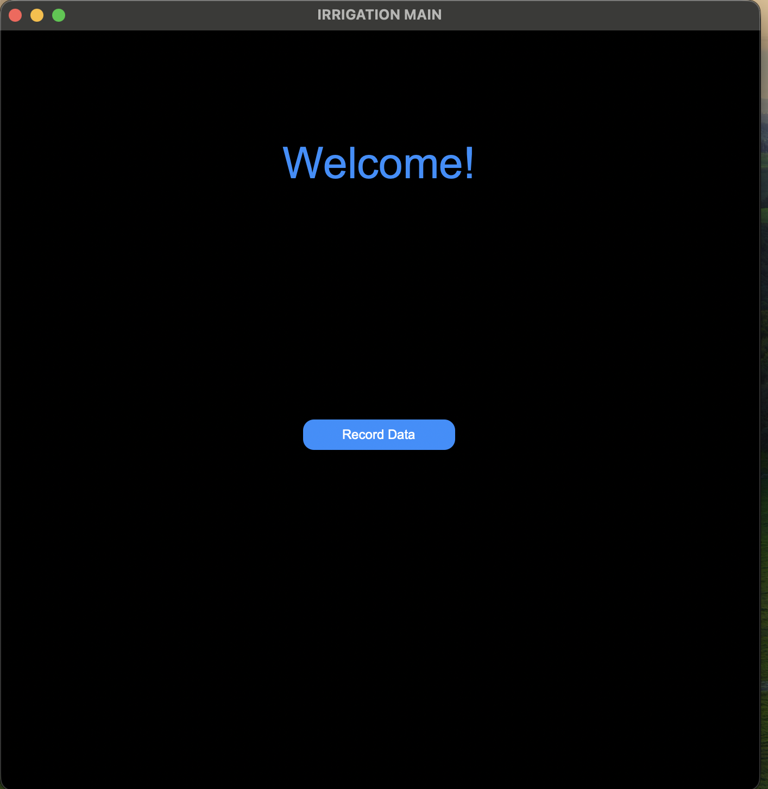
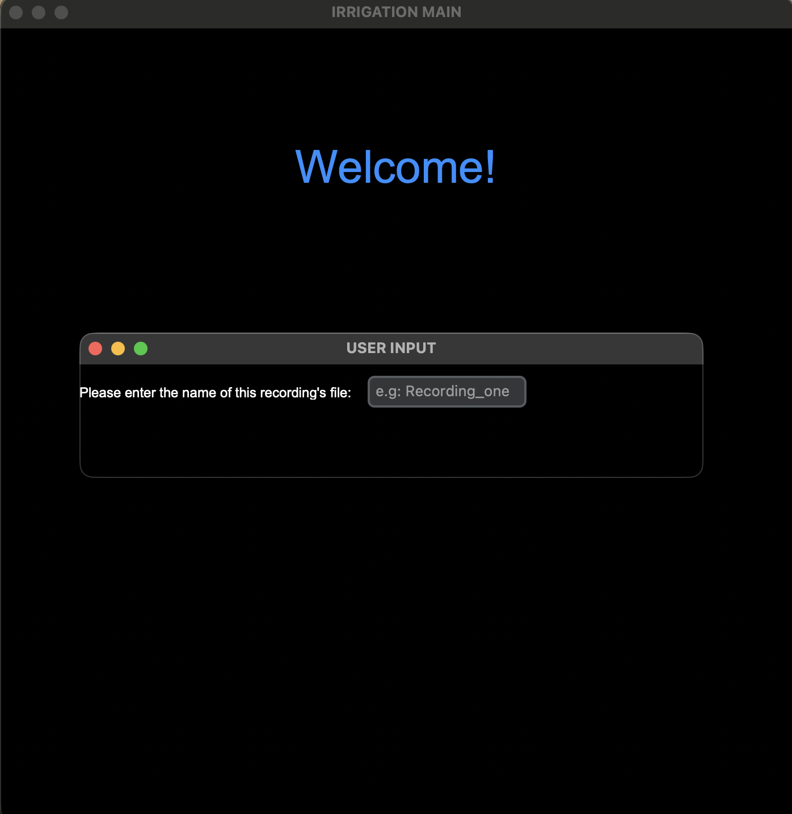

# Irrigation Main App

## Overview
The **Irrigation Main App** is a graphical user interface (GUI) built with **Python** and **CustomTkinter** to assist with soil moisture data collection and image post-processing.  

It provides tools for recording images using a camera module, consolidating those images with corresponding soil moisture readings, and preparing them for upload (e.g., to Roboflow for AI training).

---

## Features

### User-Friendly GUI
- Built using **CustomTkinter** for a modern interface.  
- Provides intuitive dialogs and visual feedback.  
- Modular layout allows easy extension for new tools (e.g., Roboflow upload, data visualization, etc.).  



### Camera Recording
- Captures and stores images directly from the connected camera.  
- Automatically saves each captured image in the `GUI/DataCollection/Data` directory.  




###  Data Consolidation
- Combines recorded images with corresponding moisture readings stored in a CSV file (`moistures.csv`).  
- Draws the moisture value directly on each image.  
- Saves consolidated images into the `Post-Processing` folder.  
- Prevents continuation if `moistures.csv` is empty or missing valid data.  

 


---

##  Project Structure
```
Irrigation-Main-App/
│
├── application.py
├── GUI/
│   ├── MainWindow.py
│   ├── helper.py
│   ├── styler.py
│   ├── RecordWindow.py
│   │
│   └── DataCollection/
│       ├── Data/               # Captured images
│       ├── Post-Processing/    # Consolidated images + CSV
│       ├── Recordings/
│       │   ├── camera.py
│       │   └── consolidate.py
│       ├── RoboFlow/
│       │   ├── roboflow.py     # Roboflow upload logic
│       │   └── .env            # API key, workspace, project ID           
│       └── YOLO/               
│      
└── README.md
```
---
### Create and Activate a Virtual Environment
#### terminal command:
```bash
python -m venv venv
```
#### Activate Virtual Environment:
- On macOS/Linux
```bash
source venv/bin/activate     
```
- On Windows
```bash
venv\Scripts\activate        
```
`You can also use python3 instead of python if needed.`

---

### Install Required Dependencies:
```bash
pip install -r requirements.txt
```
### Running the Application:
```bash
python application.py
```
`You can also use python3 application.py if your system requires it.`

---
### Workflow
- Launch the GUI.
- Use the Recording feature to capture and save new images.
- Once moisture readings are available (in moistures.csv), run Consolidation.
- View or upload the consolidated results as needed.

## Future Enhancements
- **Roboflow integration:** Downloading datasets directly from the GUI
- AI-based soil moisture prediction  

## Notes for Developers
- The **camera** module uses OpenCV for image capture.  
- The **consolidation** module checks for a valid CSV and prevents proceeding if the file is empty.  
- The **helper.py** module:
  - Connects messages and feedback to the GUI.
  - Serves as the bridge between backend logic and the user interface.
---
### Author:
Developed by **Yarely Torres** <br>
Project: Irrigation Main App – AI-Powered Soil Moisture Monitoring